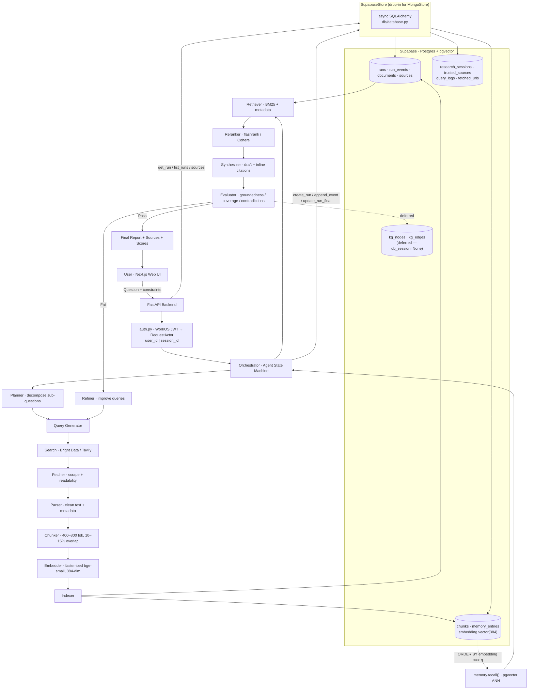

# Nexara — V2 Architecture & Supabase Migration Spec

> Autonomous Research Agent (Recursive RAG). This document supersedes the
> deleted `project.md`. It is written as an **executable specification**: an AI
> agent or engineer should be able to perform the MongoDB → Supabase migration
> using only this file plus the codebase.
>
> **Headline change:** the runtime data layer moves from **MongoDB** to
> **Supabase (managed Postgres + pgvector)**. Prisma, the dormant standalone
> SQLAlchemy/Neon wiring, and Mongo are all consolidated into one Postgres
> stack reached through async SQLAlchemy.

---

## 0. TL;DR for the implementing agent

The runtime **only** uses MongoDB today (`app/db/mongo.py`). The SQLAlchemy
ORM in `app/db/models.py`, Alembic, and `knowledge_graph.py`'s DB paths are
written but **never reached at runtime** (the orchestrator is always
constructed with `db_session=None, run_store=<MongoStore>`).

The migration is therefore:

1. Make `app/db/database.py` (already async SQLAlchemy) the single engine,
   pointed at Supabase.
2. Replace `MongoStore` with a `SupabaseStore` exposing the **exact same
   method signatures** (listed in §5) so no caller changes shape.
3. Reuse the existing `app/db/models.py` ORM tables — they already model
   everything (§4). Add the small missing tables (`fetched_urls`) and align
   field names (§4.3).
4. Swap `ensure_mongo_ready()` → `ensure_database_ready()` in `app/main.py`.
5. Move semantic memory recall from in-Python cosine to a `pgvector` query
   (§6.3) — this is the one behavioral upgrade, everything else is parity.
6. Keep Alembic migration files **gitignored** (§9).

Acceptance criteria are in §10.

---

## 1. What this project is

Nexara converts a question into a **structured, citation-backed report** via an
iterative agent loop instead of one LLM call:

```
intake → plan → query → search → fetch/parse → index → retrieve → rerank →
synthesize → evaluate → (refine ↺) → finalize
```

Complex questions are decomposed into sub-questions; evidence is gathered from
the web (and optional user uploads), stored with metadata, retrieved via hybrid
retrieval + reranking, and written into a report where each key claim is
grounded in citations. An evaluator checks groundedness, coverage,
contradictions, and source diversity; failing thresholds trigger query
refinement and another loop, up to a safe iteration cap. The UI streams a live
research trace over SSE.

---

## 2. Repository layout

```
Nexara/
├── apps/
│   ├── api/                      # FastAPI backend (Python 3.11)
│   │   ├── app/
│   │   │   ├── main.py           # app factory, lifespan (DB readiness here)
│   │   │   ├── config.py         # pydantic-settings; DATABASE_URL lives here
│   │   │   ├── auth.py           # WorkOS JWT → RequestActor {user_id|session_id}
│   │   │   ├── db/
│   │   │   │   ├── database.py    # async SQLAlchemy engine/session (KEEP)
│   │   │   │   ├── models.py      # 13 ORM tables (REUSE as schema source)
│   │   │   │   ├── mongo.py       # MongoStore (REPLACE → SupabaseStore)
│   │   │   │   └── __init__.py    # re-exports (UPDATE)
│   │   │   ├── api/v1/            # runs.py, sources.py, memory.py, health.py …
│   │   │   └── services/         # 28 modules (orchestrator, memory, KG, …)
│   │   ├── alembic/              # migrations (versions/ gitignored — §9)
│   │   └── scripts/check_db.py   # `make check-db` connectivity probe
│   └── web/                      # Next.js 15 / React 19 (NO direct DB access)
├── V2 architecture.md            # this file
├── README.md
└── Makefile
```

---

## 3. V1 → V2 change table

| Concern | V1 (as-built) | V2 (target) | Action |
|---|---|---|---|
| Runtime store | MongoDB (`MongoStore`) | Supabase Postgres (`SupabaseStore`) | Rewrite `db/mongo.py` |
| Dormant store | Unused SQLAlchemy + Alembic + Neon refs | The **only** stack, on Supabase | Promote `db/database.py` |
| Web DB | Prisma `@prisma/client` | None — web → API only | **Done** (removed) |
| Vector search | In-Python cosine over all rows | `pgvector` `<=>` ANN query | New (§6.3) |
| Schema mgmt | Prisma `db push` + Alembic in parallel | Alembic only, files gitignored | §9 |
| Readiness check | `ensure_mongo_ready()` | `ensure_database_ready()` | `main.py` swap |
| Health endpoint | (web) Prisma ping | API `SELECT 1`; web proxies it | **Done** (proxy) |

---

## 4. Data model (Supabase Postgres)

### 4.1 Source of truth

`apps/api/app/db/models.py` already defines SQLAlchemy 2.0 models for every
entity. **Do not invent a new schema** — use these. Generate the Alembic
revision with `make migration m="supabase baseline"` from these models.

### 4.2 Tables

| Table | Key columns | Purpose |
|---|---|---|
| `runs` | `id uuid PK`, `user_id`, `session_id`*, `thread_id`, `gate_route`, `query`, `constraints_json`, `status`, `report_md`, `report_json`, `scores_json`, `model_name`, `iteration_count`, `created_at`, `finished_at` | One research run |
| `run_events` | `id uuid PK`, `run_id FK→runs`, `timestamp`, `state`, `message`, `payload_json` | Trace timeline (powers live UI) |
| `documents` | `id uuid PK`, `url unique`, `title`, `domain`, `source_type`, `published_at`, `fetched_at`, `raw_text`, `clean_text`, `metadata_json`, `content_hash` | Fetched pages |
| `chunks` | `id uuid PK`, `document_id FK`, `run_id FK`, `chunk_index`, `chunk_text`, `token_count`, `embedding vector(384)`, `metadata_json` | Embedded passages |
| `citations` | `id uuid PK`, `run_id FK`, `document_id FK`, `chunk_id FK`, `claim_text`, `snippet`, `url`, `section_key` | Claim ↔ evidence linkage |
| `claims` | `id uuid PK`, `run_id FK`, `section`, `text`, `citation_chunk_ids[]`, `confidence`, `verification_status`, … | Extracted claims |
| `verification_results` | `id uuid PK`, `run_id FK`, `iteration`, score columns, `overall_passed`, `feedback_json` | Per-iteration eval |
| `kg_nodes` | `id uuid PK`, `type`, `canonical_name`, `aliases[]`, `metadata_json` | KG entities |
| `kg_edges` | `id uuid PK`, `from_node_id FK`, `to_node_id FK`, `relation_type`, `confidence`, `run_id FK` | KG relations |
| `research_sessions` | `id uuid PK`, `user_id`, `title`, `run_ids[]`, `context_json`, `created_at`, `updated_at` | Thread summaries / multi-turn |
| `trusted_sources` | `id uuid PK`, `user_id`, `domain`, `label`, `trust_level`; unique `(user_id, domain)` | User-curated reliable domains |
| `memory_entries` | `id uuid PK`, `user_id`, `category`, `content`, `embedding vector(384)`, `source_run_id`, `confidence`, `access_count`, `is_active`, `created_at`, `updated_at` | Cross-session semantic memory |
| `query_logs` | `id uuid PK`, `user_id`, `query`, `run_id`, `created_at` | Research history |
| **`fetched_urls`** (NEW) | `id uuid PK`, `actor_id` (user_id or session_id), `url`, `created_at`; unique `(actor_id, url)` | Dedup of already-fetched URLs (used by `memory.is_url_already_fetched`) |

\* **Schema gap to fix:** `models.py` `Run` has no `session_id` column, but the
Mongo runtime writes/queries `session_id` for anonymous users (see
`runs.py:491`, `MongoStore._scope_filter`). **Add** `session_id: Mapped[str|None]`
to the `Run` model (indexed) before generating the migration. Same applies to
any place anonymous `session_id` scoping is used.

### 4.3 Field-name mapping (Mongo doc → Postgres column)

The Mongo docs and ORM columns mostly align. Watch these:

| Mongo doc key | Postgres column | Note |
|---|---|---|
| `id` (str uuid) | `id` (uuid) | Cast `str` ↔ `uuid` at the store boundary |
| `citations` (list on run doc) | `citations` table rows | In Mongo, citations are embedded in the run doc; in PG they are rows. `update_run_final` must upsert into the `citations` table (or keep a `report_json.citations` mirror — see §5 note). |
| `payload_json` | `run_events.payload_json` | JSON/JSONB |
| `constraints_json`, `report_json`, `scores_json` | same | `JSONB` |
| `timestamp` (events) | `run_events.timestamp` | tz-aware |

### 4.4 Required Postgres extension

```sql
CREATE EXTENSION IF NOT EXISTS vector;   -- pgvector, for chunks/memory embeddings
```
Enable `vector` in the Supabase dashboard (Database → Extensions) **before**
running migrations, since `models.py` declares `Vector(384)` columns.

### 4.5 Indexes (must be in the migration)

- `runs (user_id, created_at desc)`, `runs (session_id, created_at desc)`,
  `runs (thread_id, created_at desc)`, `runs (status)`
- `run_events (run_id, timestamp)`
- `documents (content_hash)`, unique `documents (url)`
- `chunks (document_id)`, `chunks (run_id)`
- `memory_entries (user_id, category)`, `memory_entries (user_id, is_active)`
- pgvector ANN: `CREATE INDEX ON memory_entries USING hnsw (embedding vector_cosine_ops);`
  and same on `chunks.embedding`
- unique `trusted_sources (user_id, domain)`, unique `fetched_urls (actor_id, url)`

---

## 5. Store interface to implement (`SupabaseStore`)

`SupabaseStore` must be a drop-in for `MongoStore`. These signatures are
**load-bearing** — they are called verbatim from `runs.py`, `sources.py`,
`orchestrator.py`, `main.py`. Do not change names, argument order, or return
shapes. All methods are `async` (wrap sync SQLAlchemy in the existing async
session from `db/database.py`).

```python
class SupabaseStore:
    # ---- lifecycle ----
    async def ping() -> None
    async def ensure_indexes() -> None          # no-op if Alembic owns schema

    # ---- runs ----
    async def create_run(doc: dict) -> None
    async def get_run(run_id: str, user_id=None, session_id=None) -> dict | None
    async def run_exists(run_id: str, user_id=None, session_id=None) -> bool
    async def list_runs(limit: int, offset: int, user_id=None, session_id=None) -> list[dict]
        # MUST collapse threads: one row per thread_id (latest run), newest first.
        # Mongo impl groups by {$ifNull:[thread_id,id]}; replicate with
        # DISTINCT ON (coalesce(thread_id,id)) ... ORDER BY created_at DESC.
    async def get_thread_runs(thread_id: str, user_id=None, session_id=None) -> list[dict]
    async def update_run_final(*, run_id, status, report_md, report_json,
                               scores_json, citations, model_name,
                               iteration_count) -> None
    async def mark_run_failed(run_id: str) -> None
    async def delete_run(run_id: str, user_id=None, session_id=None) -> bool
        # Cascade: also delete run_events + sources for that run
        # (Mongo did it manually; in PG use ON DELETE CASCADE FKs).

    # ---- run events ----
    async def append_event(*, event_id, run_id, state, message,
                           payload, timestamp=None) -> None
    async def get_events(run_id: str, state: str | None = None) -> list[dict]
        # ordered by timestamp ascending

    # ---- sources ----
    async def create_source(doc: dict) -> dict
    async def create_sources(docs: list[dict]) -> list[dict]
    async def get_source(source_id: str) -> dict | None
```

**Scoping rule (security-critical):** every read that takes
`user_id`/`session_id` MUST filter by it. Port `MongoStore._scope_filter`
exactly: if `user_id` → filter `user_id=`; elif `session_id` → filter
`session_id=`; else → return nothing (the Mongo sentinel `{"_id":"__no_actor__"}`
means "match no rows"). Returning unscoped rows would leak other users' runs.

**Return shape:** callers expect plain `dict`s with the **Mongo doc keys**
(`id` as `str`, `citations` as a list on the run dict, etc.), not ORM objects.
Add a `_row_to_dict()` adapter so `runs.py`/`sources.py` stay untouched. For
`update_run_final`, persist `citations` both as `citations` rows and mirrored
into `report_json` (callers like `_normalize_citations` read them off the run
dict).

`get_mongo_store()` / `ensure_mongo_ready()` / `describe_mongo_error()` are
imported by name in `runs.py`, `sources.py`, `memory.py`, `main.py`,
`db/__init__.py`. Provide aliases (`get_store`, `ensure_database_ready`,
`describe_db_error`) and keep thin shims under the old names, OR update those
6 import sites. Prefer updating the import sites and deleting the Mongo names.

---

## 6. Service-level changes

### 6.1 `app/main.py`
Replace:
```python
from app.db.mongo import ensure_mongo_ready
...
await ensure_mongo_ready()
```
with `ensure_database_ready()` from `app/db/database.py` (already exists, does
retrying `SELECT 1`). Keep the `ALLOW_START_WITHOUT_DB` short-circuit.

### 6.2 `app/api/v1/runs.py` & `sources.py`
No logic changes if `SupabaseStore` honors §5. Only the import line and the
`_get_store_or_503()` helper's exception type may need updating
(`MongoUnavailableError` → a generic `StoreUnavailableError`).

### 6.3 `app/services/memory.py` — the one behavioral upgrade
Current `recall()` loads **all** of a user's `memory_entries` and computes
cosine similarity in Python (`memory.py:165-176`). On Postgres, push this into
pgvector:

```sql
SELECT id, category, content, confidence, access_count, source_run_id,
       created_at, metadata_json,
       1 - (embedding <=> :query_embedding) AS score
FROM memory_entries
WHERE user_id = :user_id AND is_active = true
ORDER BY embedding <=> :query_embedding
LIMIT :top_k;
```
Then keep the existing side effect (increment `access_count`, bump
`updated_at` on the returned rows). Collections map to tables:
`memory_entries`, `research_sessions` (thread summaries), `trusted_sources`,
and the new `fetched_urls`. Reimplement `_insert_one/_find_one/_find_many/`
`_update_one/_aggregate` as thin SQLAlchemy helpers, or replace call sites with
typed queries — keep `MemoryService`'s public method signatures
(`store_memory`, `recall`, `upsert_thread_summary`, `get_thread_summary`,
`get_context_bundle`, `store_run_memory_bundle`, `list_memories`,
`delete_memory`, `get_stats`, `add_trusted_source`, `list_trusted_sources`,
`remove_trusted_source`, `is_url_already_fetched`) **unchanged**.

### 6.4 `app/services/knowledge_graph.py`
Already written against `AsyncSession`. Once a real session exists, the
orchestrator can pass `db_session=<session>` instead of `None`. **Decision
for V2:** keep `db_session=None` initially (KG stays a no-op as today) to keep
the migration minimal; enabling KG persistence is a fast-follow once
`SupabaseStore` is stable. Document this as a known deferred item.

### 6.5 `app/services/orchestrator.py`
The orchestrator already has both a `_run_store` (Mongo) path and a `_db`
(SQLAlchemy) path with raw `INSERT/UPDATE` SQL fallbacks (`append_event`,
`_persist_final`). Keep using the `_run_store` path (now `SupabaseStore`); the
raw-SQL `_db` branches remain dead unless KG is enabled. No change required.

---

## 7. Connection & configuration

`DATABASE_URL` (single var, already in `config.py`) must be the Supabase
**async** URI:
```
postgresql+asyncpg://postgres:<password>@db.<project-ref>.supabase.co:5432/postgres
```
Use the connection-pooler port `6543` (pgBouncer, transaction mode) for
serverless/Vercel; `5432` for long-lived local dev. `db/database.py` already
sets `pool_pre_ping=True`, `pool_size=5`, `max_overflow=10` — keep these; for
the pooler add `?prepared_statement_cache_size=0` style handling if asyncpg +
pgBouncer prepared-statement conflicts appear.

Driver deps already in `apps/api/requirements.txt`:
`sqlalchemy[asyncio]==2.0.35`, `psycopg[binary]`, `pgvector>=0.3.0`,
`alembic==1.13.2`. **Add** `asyncpg` (the `+asyncpg` driver) if not present.
`pymongo==4.10.1` can be **removed** once `SupabaseStore` lands.

---

## 8. Migration / cutover procedure

This is greenfield data-wise (dev DB), so no Mongo→PG data backfill is
required. If a backfill is ever needed, the doc-key↔column map in §4.3 plus a
one-off script reading Mongo collections and `INSERT`ing rows is sufficient.

Order of operations for the agent:

1. Enable `vector` extension in Supabase.
2. Add `Run.session_id` (+ `fetched_urls` model) to `app/db/models.py`.
3. `make migration m="supabase baseline"` → generates `versions/xxxx_*.py`
   (local only, gitignored).
4. `make migrate` → applies to Supabase.
5. Implement `SupabaseStore` in `app/db/mongo.py` (rename file to
   `app/db/store.py`; update the 6 import sites + `db/__init__.py`).
6. Swap `main.py` readiness call.
7. Upgrade `memory.recall()` to pgvector query.
8. `make check-db` → expect `Supabase OK`.
9. Run `make test` (pytest fixtures use `conftest.py` — point its DB at a
   Supabase test schema or a local Postgres with pgvector).
10. Manual smoke: `POST /v1/runs`, watch `/v1/runs/{id}/stream`, confirm row
    in `runs`, events in `run_events`, final report persisted.
11. Remove `pymongo` from requirements; delete dead Mongo error helpers.

---

## 9. Open-source constraint (must hold)

This repo is public. **Alembic migration files and any SQL/dump artifacts must
never be pushed to GitHub** — they expose schema internals and bloat public
history. Enforced via `.gitignore`:

```
apps/api/alembic/versions/*.py
!apps/api/alembic/versions/__init__.py
*.sql
*.dump
```
`__init__.py` stays tracked so the package imports. Contributors regenerate
migrations locally with `make migration`. `.env*` remain gitignored; only
`.env.example` (Supabase placeholder URI) is tracked. The previously tracked
`versions/00{1..4}_*.py` were `git rm --cached`'d (kept on disk locally).

---

## 10. Acceptance criteria (definition of done)

- [ ] `grep -rn "pymongo\|MongoStore\|mongo" apps/api/app` returns nothing
      meaningful (only history/comments).
- [ ] `make check-db` prints `Supabase OK`.
- [ ] `POST /v1/runs` → row in `runs`; `/stream` emits SSE; `run_events`
      populated; final `report_md`/`scores_json` persisted via
      `update_run_final`.
- [ ] Anonymous (`session_id`) and authed (`user_id`) runs are correctly
      scoped — user A cannot read user B's runs (port `_scope_filter`).
- [ ] `list_runs` returns one row per `thread_id`, newest first.
- [ ] `memory.recall()` uses a pgvector `ORDER BY embedding <=>` query and
      still bumps `access_count`.
- [ ] `delete_run` cascades to `run_events` + `sources`.
- [ ] `make test` green; `apps/api/alembic/versions/*.py` not tracked by git.
- [ ] Web `/api/db/health` returns `{provider: "supabase-postgres"}` (proxy
      to API `/health` — already implemented).

---

## 11. Architecture diagram



---

## 12. Retrieval & evaluation (behavior — unchanged from V1 intent)

- **Chunking:** 400–800 tokens, 10–15% overlap, metadata-tagged
  (`source_domain`, `published_at`, `document_title`, `section_heading`).
- **Retrieval:** BM25 + metadata/domain scoring; recency / domain
  allowlist-blocklist / language filters.
- **Reranking:** cross-encoder → top 3–8 evidence chunks per sub-question;
  dedup near-identical chunks; enforce source diversity.
- **Evaluation goals:** groundedness (claims cited + LLM-judge that the cited
  snippet supports the claim), coverage (all sub-questions answered),
  contradictions (surfaced in an explicit uncertainty section), source
  quality/diversity (penalize single-domain dominance).
- **Self-improving loop:** on eval failure the Refiner emits missing
  sub-questions, missing evidence types, and new targeted queries; loop repeats
  up to `MAX_ITERATIONS` / `MAX_AGENT_ITERS`.
- **Learning memory:** winning query templates, trusted/avoid lists, and
  recurring failure modes persist in `memory_entries` and are recalled via
  pgvector for faster future convergence.
```
